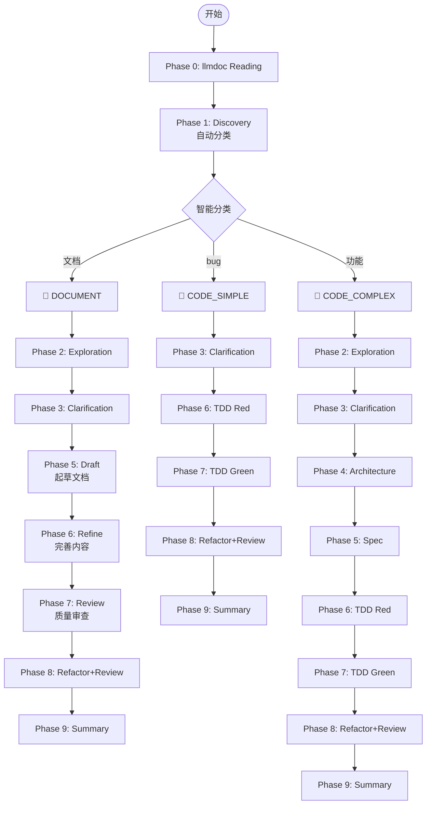
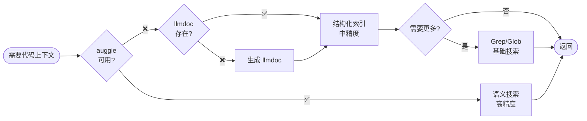

# gclm-flow 核心配置

## 核心哲学

**SpecDD + TDD + Document-First + llmdoc 优先 + 智能分流 + 多 Agent 并行**

1. **SpecDD**: 复杂模块先写规范文档
2. **TDD**: 测试驱动开发
3. **llmdoc 优先**: 任何代码操作前先读取文档
4. **智能分流**: 自动判断任务类型
5. **并行执行**: 关键阶段并行执行

---

## Agent 体系

### 自定义 Agents (gclm-flow)

| Agent | 职责 | 模型 | 用途 |
|:---|:---|:---|:---|
| `investigator` | 代码库调查、分析 | Haiku 4.5 | Phase 1/2/9 |
| `architect` | 架构设计、方案权衡 | Opus 4.5 | Phase 4 |
| `spec-guide` | SpecDD 规范文档编写 | Opus 4.5 | Phase 5 |
| `tdd-guide` | TDD 流程指导 | Sonnet 4.5 | Phase 6 |
| `worker` | 执行明确定义的任务 | Sonnet 4.5 | Phase 7 |
| `code-reviewer` | 代码审查 | Sonnet 4.5 | Phase 8 |

### 官方插件 (外部)

| Agent | 插件名 | 职责 | 用途 |
|:---|:---|:---|:---|
| `code-simplifier` | `code-simplifier@claude-plugins-official` | 代码简化重构 | Phase 8 |
| `security-guidance` | `security-guidance@claude-plugins-official` | 安全审查 | Phase 8 |

---

## 智能分流工作流

### 三种工作流类型

| 类型 | 检测关键词 | 适用场景 | 阶段数 |
|:---|:---|:---|:---:|
| 📝 **DOCUMENT** | 文档、方案、设计、需求 | 文档编写 | 7 |
| 🔧 **CODE_SIMPLE** | bug、修复、error | Bug修复/小修改 | 6 |
| 🚀 **CODE_COMPLEX** | 功能、模块、开发、重构 | 新功能/复杂变更 | 9 |

### 工作流程图



---

## 代码搜索策略

### 分层回退机制



### 搜索方法对比

| 方法 | 精度 | 速度 | 状态 |
|:---|:---:|:---:|:---:|
| **auggie** (语义搜索) | 高 | 快 | 推荐 |
| **llmdoc** (结构化) | 中 | 快 | 默认 |
| **Grep** (模式匹配) | 低 | 慢 | 备选 |

### auggie 安装（推荐）

```bash
npm install -g @augmentcode/auggie@prerelease
```

### investigator 与 auggie

**Phase 1/2/9** 使用 `investigator` agent 时：
- 如果 auggie 可用，优先使用语义搜索
- 如果 auggie 不可用，回退到 llmdoc + Grep
- **auggie 是 investigator 的增强工具，不是独立的 Phase**

---

## Phase 详细说明

### Phase 0: llmdoc Reading

**目标**: 在任何代码操作前建立上下文理解

**强制执行**，不可跳过。

1. 检查 `llmdoc/` 是否存在
2. 如果存在，读取 `llmdoc/index.md` 和 `llmdoc/overview/*.md`
3. 如果不存在，自动生成（无需确认）

### Phase 1: Discovery

**Agent**: `investigator`

**目标**: 理解需求，自动检测工作流类型

**输出**: 工作流类型判断 + 需求概述

### Phase 2: Exploration

**Agent**: `investigator` x3 (并行)

**目标**: 并行探索相关内容

- Agent 1: 相似功能搜索
- Agent 2: 架构映射
- Agent 3: 代码规范识别

### Phase 3: Clarification

**目标**: 澄清疑问 + 确认/调整工作流类型

**强制执行**，不可跳过。

### Phase 4: Architecture (CODE_COMPLEX only)

**Agent**: `architect` x2 + `investigator` (并行)

**输出**:
- 组件关系图
- 技术选型
- 目录结构

详见 `rules/spec.md`

### Phase 5: Spec / Draft (CODE_COMPLEX / DOCUMENT)

**CODE_COMPLEX**: `spec-guide` - 编写规范文档

**DOCUMENT**: 起草文档/方案

详见 `rules/spec.md`

### Phase 6: Refine / TDD Red

**DOCUMENT**: 完善内容

**CODE**: `tdd-guide` - 编写测试（必须先写测试！）

详见 `rules/tdd.md`

### Phase 7: Review / TDD Green

**DOCUMENT**: 质量审查

**CODE**: `worker` - 编写实现

### Phase 8: Refactor+Review

**Agent**: `code-simplifier` + `security-guidance` + `code-reviewer` (并行)

**目标**: 重构优化 + 安全审查 + 代码审查

### Phase 9: Summary

**Agent**: `investigator`

**目标**: 完成总结

---

## TDD 规范

详见 `rules/tdd.md`

### 核心流程

```
RED → GREEN → REFACTOR
```

### 关键约束

1. 绝不一次性生成代码和测试
2. 先写测试，后写实现
3. 测试必须先失败
4. 覆盖率 > 80%

---

## SpecDD 规范

详见 `rules/spec.md`

### 核心流程

```
Phase 4 (Architecture) → Phase 5 (Spec) → Phase 6 (TDD Red)
```

### 适用场景

- 新功能开发
- 跨模块变更 (3+ 文件)
- API 设计
- 数据结构设计

---

## 约束检查清单

### Phase 0

- [ ] 读取 llmdoc/index.md
- [ ] 读取 llmdoc/overview/*.md

### Phase 3

- [ ] 澄清所有疑问
- [ ] 确认/调整工作流类型

### Phase 5 (CODE_COMPLEX)

- [ ] 使用 spec-guide 编写规范文档
- [ ] 输出 .claude/specs/{feature-name}.md

### Phase 6 (CODE)

- [ ] 先写测试
- [ ] 测试失败后再写实现

### Phase 8

- [ ] 并行执行简化、安全、审查

---

## 可用命令

| 命令 | 用途 |
|:---|:---|
| `/gclm <任务>` | 智能分流工作流 |
| `/investigate <问题>` | 代码库调查 |
| `/tdd <功能>` | 测试驱动开发 |
| `/spec <功能>` | 规范驱动开发 |
| `/llmdoc` | 文档生成/更新 |

---

## 文件操作规范

| 操作 | 推荐工具 | 禁止使用 | 说明 |
|:---|:---|:---|:---|
| 读取 | cat, head, tail, `Read` | - | shell 更快 |
| 搜索文件 | find, ls, `Glob` | - | shell 更快 |
| 搜索内容 | grep, `Grep` | - | shell 更快 |
| 创建 | `Write` | touch, echo, cat > | **禁止 shell 创建** |
| 编辑 | `Read` + `Write` | sed, awk, vim | **禁止 shell 编辑** |

### 操作说明

**读取和搜索** - shell 工具更快更直接：
```bash
# 读取文件
cat file.txt
head -20 file.txt
tail -50 file.txt

# 搜索文件
find . -name "*.ts"
ls -la src/

# 搜索内容
grep "pattern" file.txt
```

**创建和编辑** - 使用专用工具：
```javascript
// 创建新文件
Write(path, content)

// 编辑文件（复杂）
Read(path) → 修改 → Write(path, newContent)

// 编辑文件（简单替换）
Edit(path, oldText, newText)
```

### 编辑操作注意事项

**重要**: shell 编辑工具容易出错，请避免：

1. **避免**: sed, awk, perl, vim 进行编辑
2. **推荐**: Read + Write 组合处理复杂编辑
3. **谨慎**: Edit 工具仅用于简单替换（确保上下文唯一）

**为什么 shell 编辑容易出错**：
- 上下文重复导致替换错误
- 特殊字符转义问题
- 多行替换的解析问题

---

## 代码风格

- **不可变性**: 优先使用不可变对象
- **小文件**: 200-400 行，避免 >800 行
- **纯净代码**: 禁止使用 Emoji
- **清晰命名**: 变量/函数名要自解释

---

## Git 操作规范

- **Commit**: Conventional Commits (feat:, fix:, refactor:, docs:, test:)
- **原则**: 只读模式为主

---

## 成功指标

1. 测试通过，覆盖率 > 80%
2. 无已知安全漏洞
3. 代码可读性高
4. 需求完整满足
5. 文档已更新（如选择）
