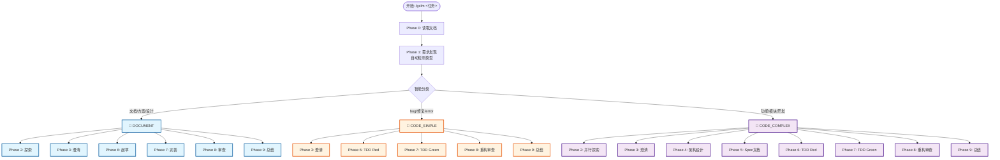

# gclm-flow

> 智能分流工作流插件 - 自动判断任务类型，选择最优开发流程

---

## 快速导航

| 我想... | 立即跳转 |
|:---|:---|
| **快速安装** | [安装指南](#安装) |
| **怎么用** | [使用方法](#使用方法) |
| **工作流是什么** | [工作流概览](#工作流概览) |
| **有哪些命令** | [可用命令](#可用命令) |
| **Agent 体系** | [Agent 体系](#agent-体系) |
| **项目结构** | [目录结构](#目录结构) |

---

## 安装

```bash
# 方式 1: 插件市场 (推荐)
/plugin marketplace add https://github.com/gclm/gclm-flow
/plugin install gclm@gclm-flow

# 方式 2: 手动安装
cd /tmp && git clone https://github.com/gclm/gclm-flow.git
cd gclm-flow && bash install.sh
```

**完成！** 配置自动激活，无需额外设置。

---

## 使用方法

### 基本使用

```bash
# 启动智能工作流 (自动判断任务类型)
/gclm 实现用户登录功能

# 快速代码库调查
/investigate 认证系统是怎么工作的？

# TDD 开发
/tdd 实现密码验证函数

# SpecDD 开发
/spec 生成支付模块规范文档
```

### 它能做什么

| 行为 | 说明 |
|:---|:---|
| **智能分流** | 自动判断任务类型 (文档/Bug修复/功能开发) |
| **文档优先** | 任何操作前先读取项目文档 (llmdoc) |
| **TDD 强制** | 测试驱动开发，覆盖率 > 80% |
| **安全审查** | 自动检查安全漏洞 |
| **代码简化** | 自动重构优化代码 |

---

## 工作流概览

### 三种工作流类型



### 工作流对比

| 类型 | 适用场景 | 核心阶段 | 跳过 |
|:---|:---|:---|:---|
| 📝 **DOCUMENT** | 文档编写、方案设计 | Draft → Refine → Review | Architecture, Spec |
| 🔧 **CODE_SIMPLE** | Bug 修复、小修改 | TDD Red → TDD Green | Exploration, Architecture, Spec |
| 🚀 **CODE_COMPLEX** | 新功能、模块开发 | **全流程** (含 SpecDD) | - |

### 9 阶段说明

| 阶段 | DOCUMENT | CODE_SIMPLE | CODE_COMPLEX |
|:---|:---:|:---:|:---:|
| 0: 读取文档 | ✅ | ✅ | ✅ |
| 1: 需求发现 | ✅ | ✅ | ✅ |
| 2: 探索研究 | ✅ | ❌ | ✅ |
| 3: 澄清确认 | ✅ | ✅ | ✅ |
| 4: 架构设计 | ❌ | ❌ | ✅ |
| 5: Spec 文档 | ❌ | ❌ | ✅ |
| 6: Red/起草 | ✅ | ✅ | ✅ |
| 7: Green/完善 | ✅ | ✅ | ✅ |
| 8: 审查重构 | ✅ | ✅ | ✅ |
| 9: 总结 | ✅ | ✅ | ✅ |

---

## 可用命令

| 命令 | 触发词 | 用途 |
|:---|:---|:---|
| `/gclm` | "实现功能"、"开发" | 智能分流工作流 |
| `/investigate` | "是什么"、"怎么工作" | 代码库调查 |
| `/tdd` | "写测试"、"TDD" | 测试驱动开发 |
| `/spec` | "生成规范"、"Spec" | 规范驱动开发 |
| `/llmdoc` | "更新文档"、"生成文档" | 文档生成/更新 |

---

## Agent 体系

### gclm-flow 自定义 Agents

| Agent | 职责 | 模型 |
|:---|:---|:---|
| `investigator` | 探索、分析、总结 | Haiku 4.5 |
| `architect` | 架构设计、方案权衡 | Opus 4.5 |
| `worker` | 执行明确定义的任务 | Sonnet 4.5 |
| `tdd-guide` | TDD 流程指导 | Sonnet 4.5 |
| `spec-guide` | SpecDD 规范文档编写 | Opus 4.5 |
| `code-reviewer` | 代码审查 | Sonnet 4.5 |

### Claude Code 官方插件（外部）

| Agent | 插件名 | 职责 |
|:---|:---|:---|
| `code-simplifier` | `code-simplifier@claude-plugins-official` | 代码简化重构 |
| `security-guidance` | `security-guidance@claude-plugins-official` | 安全审查 |

---

## 外部工具

| 工具 | 用途 | 必需 |
|:---|:---|:---:|
| **auggie** | 代码搜索、上下文增强 | 推荐 |

```bash
# 安装 auggie (可选但推荐)
npm install -g @augmentcode/auggie@prerelease
```

---

## 目录结构

```
gclm-flow/
├── README.md              # 本文件
├── CLAUDE.example.md      # 示例配置
├── agents/                # Agent 定义
├── commands/              # 命令定义
├── skills/                # Skill 定义
├── rules/                 # 工作流规则
├── scripts/               # 安装脚本
├── hooks/                 # Hooks
├── llmdoc/                # 项目文档
└── docs/                  # 分析报告
```

---

## 核心特性

- **智能分流**: 自动判断任务类型，选择最优流程
- **llmdoc 优先**: 任何操作前先读取项目文档
- **SpecDD 集成**: 复杂模块先写规范文档
- **TDD 强制**: 测试驱动开发，覆盖率 > 80%
- **多 Agent 并行**: 关键阶段并行执行
- **状态持久化**: 中途可恢复

---

## 成功指标

1. 测试通过，覆盖率 > 80%
2. 无已知安全漏洞
3. 代码可读性高
4. 需求完整满足
5. 文档已更新

---

## License

MIT

---

<div align="center">

由 **gclm** 精心打造

</div>
