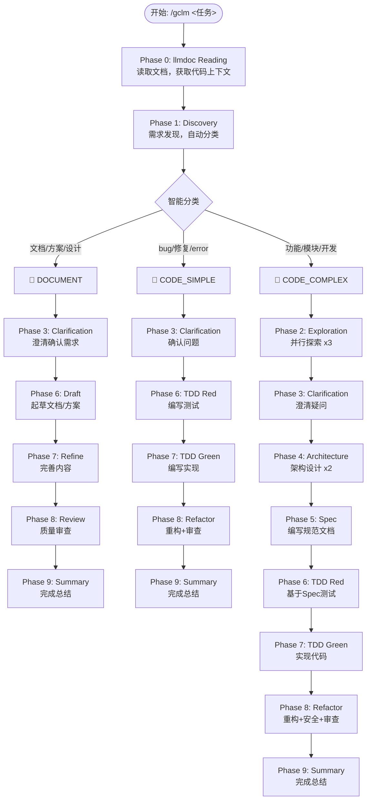

# 工作流架构

## 三种工作流类型

gclm-flow 实现了智能分流系统，根据任务内容自动选择工作流类型：

```
用户请求 → 智能分类 → 选择工作流 → 执行阶段
```

### 工作流分类逻辑

| 类型 | 检测关键词 | 适用场景 | 阶段数 |
|:---|:---|:---|:---:|
| 📝 **DOCUMENT** | 文档、方案、设计、需求、分析 | 文档编写、架构设计 | 7 |
| 🔧 **CODE_SIMPLE** | bug、修复、error、fix | Bug 修复、小修改 | 6 |
| 🚀 **CODE_COMPLEX** | 功能、模块、开发、重构 | 新功能、模块开发 | 9 |

### 关键词评分规则

```bash
# 文档类 (+5分)
编写文档、文档编写、方案设计、设计文档、需求分析、技术方案

# Bug修复类 (-5分)
修复bug、fix bug、bug修复、修复错误、解决bug

# 功能开发类 (-1分，默认)
功能、模块、开发、重构、实现
```

| 分数范围 | 分类 |
|:---:|:---|
| ≥ 3 | DOCUMENT |
| ≤ -3 | CODE_SIMPLE |
| 其他 | CODE_COMPLEX |

---

## 工作流程图



---

## 阶段详细说明

### Phase 0: llmdoc Reading

**目标**: 在任何代码操作前建立上下文理解

**流程**:
1. 检查 `llmdoc/` 是否存在
2. 存在 → 读取 `llmdoc/index.md` 和 `llmdoc/overview/*.md`
3. 不存在 → 自动生成（无需确认）

**输出**: 代码上下文摘要

### Phase 1: Discovery

**Agent**: `investigator`

**目标**: 理解需求，自动检测工作流类型

**输出**:
- Requirements (需求)
- Non-goals (非目标)
- Task Classification (任务分类)
- Estimated Files (预估文件数)

### Phase 2: Exploration (CODE_COMPLEX only)

**并行**: `Explore` x3

**目标**: 并行探索相关内容

| Agent | 任务 |
|:---|:---|
| Agent 1 | 相似功能搜索 |
| Agent 2 | 架构映射 |
| Agent 3 | 代码规范识别 |

### Phase 3: Clarification

**目标**: 澄清疑问 + 确认/调整工作流类型

**强制**: 不可跳过

### Phase 4: Architecture (CODE_COMPLEX only)

**并行**: `architect` x2 + `investigator`

**输出**:
- 组件关系图
- 技术选型
- 目录结构

### Phase 5: Spec (CODE_COMPLEX only)

**Agent**: `spec-guide`

**输出**: `.claude/specs/{feature-name}.md`

### Phase 6: TDD Red / Draft

**DOCUMENT**: 起草文档/方案

**CODE**: 编写测试（必须先写测试）

### Phase 7: TDD Green / Refine

**DOCUMENT**: 完善内容

**CODE**: 编写实现

### Phase 8: Refactor + Security + Review

**并行**:
- `code-simplifier` - 代码简化
- `security-guidance` - 安全审查
- `code-reviewer` - 代码审查

### Phase 9: Summary

**Agent**: `investigator`

**完成信号**: `<promise>GCLM_WORKFLOW_COMPLETE</promise>`

---

## 状态管理

### 状态文件

位置: `.claude/gclm.{task_id}.local.md`

```yaml
---
active: true
current_phase: 0
phase_name: "llmdoc Reading"
max_phases: 9
workflow_type: "CODE_COMPLEX"
task_description: "任务描述"
completion_promise: "<promise>GCLM_WORKFLOW_COMPLETE</promise>"
---
```

### 状态更新

每个阶段完成后自动更新状态文件，无需用户确认。

### 停止机制

- **正常退出**: 完成所有 9 个阶段
- **强制退出**: 在状态文件中设置 `active: false`
- **Stop Hook**: 检测活跃工作流，阻止中途退出
