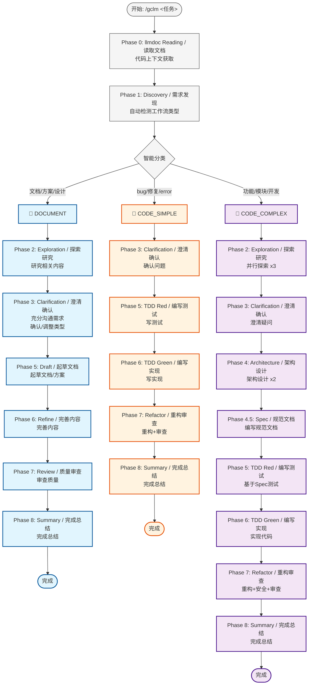
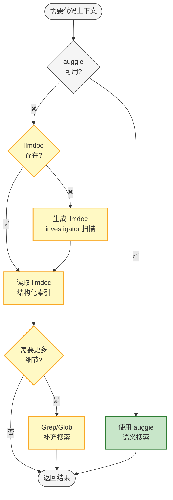

# gclm-flow 阶段规则

## 智能分流工作流

### 核心理念：SpecDD + TDD + Document-First

**SpecDD** (Specification-Driven Development) 用于复杂模块开发，**TDD** (Test-Driven Development) 用于简单功能修复，**Document-First** 用于文档编写和方案设计。

---

## 三种工作流类型

| 类型 | 检测关键词 | 适用场景 | 核心阶段 |
|:---|:---|:---|:---|
| 📝 **DOCUMENT** | 编写文档、方案设计、需求分析、架构设计 | 文档编写、方案设计、架构设计 | Discovery → Exploration → Clarification → **Draft → Refine → Review** |
| 🔧 **CODE_SIMPLE** | bug修复、fix error、调试 | Bug修复、小修改、单文件变更 | Discovery → Clarification → TDD Red → TDD Green |
| 🚀 **CODE_COMPLEX** | 功能开发、模块开发、重构 | 新功能、模块开发、跨文件变更 | **全流程** (含 SpecDD) |

---

## 工作流程图



## 代码搜索分层回退



---

## 自动分类逻辑

### 关键词检测（改进版：短语匹配优先）

```bash
# 文档类短语（+5分）
编写文档、文档编写、方案设计、设计文档、需求分析、技术方案、架构设计、API文档、Spec文档

# 文档类单词（+3分）
文档、方案、需求、分析、架构、规范、说明

# Bug修复短语（-5分）
修复bug、fix bug、bug修复、修复错误、解决bug

# Bug修复单词（-3分）
bug、修复、fix error、error fix、调试、debug

# 功能开发单词（-1分）
功能、模块、开发、重构、实现
```

### 分类阈值

| 分数范围 | 分类 | 说明 |
|:---:|:---|:---|
| ≥ 3 | DOCUMENT | 文档编写/方案设计 |
| ≤ -3 | CODE_SIMPLE | Bug修复/小修改 |
| 其他 | CODE_COMPLEX | 新功能/模块开发 |

---

## 📝 DOCUMENT 工作流

**适用**: 文档编写、方案设计、架构设计、需求分析

| 阶段 | 名称 / Name | Agent | 说明 |
|:---|:---|:---|:---|
| 0 | llmdoc Reading / 读取文档 | 主 Agent | 读取项目文档 |
| 1 | Discovery / 需求发现 | `investigator` | 理解需求 |
| 2 | Exploration / 探索研究 | `investigator` x3 | 研究相关内容/示例 |
| 3 | Clarification / 澄清确认 | 主 Agent + AskUser | **充分沟通需求 + 确认/调整工作流类型** |
| 5 | Draft / 起草文档 | 主 Agent | **起草文档/方案** |
| 6 | Refine / 完善内容 | 主 Agent | **完善内容** |
| 7 | Review / 质量审查 | `code-reviewer` | 审查质量 |
| 8 | Summary / 完成总结 | `investigator` | 完成总结 |

**关键差异**:
- Phase 5: **起草**文档
- Phase 6: **完善**内容
- Phase 3 必须充分澄清需求后再动笔

**跳过的阶段**: Phase 4 (Architecture), Phase 4.5 (Spec)

---

## 🔧 CODE_SIMPLE 工作流

**适用**: Bug 修复、小修改、单文件变更

| 阶段 | 名称 / Name | Agent | 跳过 |
|:---|:---|:---|:---:|
| 0 | llmdoc Reading / 读取文档 | 主 Agent | - |
| 1 | Discovery / 需求发现 | `investigator` | - |
| 3 | Clarification / 澄清确认 | 主 Agent + AskUser | Phase 2, 4, 4.5 |
| 5 | TDD Red / 编写测试 | `tdd-guide` | - |
| 6 | TDD Green / 编写实现 | `worker` | - |
| 7 | Refactor+Review / 重构审查 | `code-simplifier` + `security-guidance` + `code-reviewer` | - |
| 8 | Summary / 完成总结 | `investigator` | - |

**跳过的阶段**: Phase 2 (Exploration), Phase 4 (Architecture), Phase 4.5 (Spec)

---

## 🚀 CODE_COMPLEX 工作流

**适用**: 新功能、模块开发、重构

| 阶段 | 名称 / Name | Agent | 并行 |
|:---|:---|:---|:---:|
| 0 | llmdoc Reading / 读取文档 | 主 Agent | - |
| 1 | Discovery / 需求发现 | `investigator` | - |
| 2 | Exploration / 探索研究 | `investigator` x3 | 是 |
| 3 | Clarification / 澄清确认 | 主 Agent + AskUser | - |
| 4 | Architecture / 架构设计 | `architect` x2 + `investigator` | 是 |
| **4.5** | **Spec / 规范文档** | `architect` + auggie/llmdoc | **-** |
| 5 | TDD Red / 编写测试 | `tdd-guide` | - |
| 6 | TDD Green / 编写实现 | `worker` | - |
| 7 | Refactor+Review / 重构审查 | `code-simplifier` + `security-guidance` + `code-reviewer` | 是 |
| 8 | Summary / 完成总结 | `investigator` | - |

---

## 阶段详细规则

### Phase 0: llmdoc Reading + 代码搜索分层回退 (NON-NEGOTIABLE)

**目标**: 在任何代码操作前建立上下文理解

**步骤**:
1. **代码搜索分层回退**
   - 优先使用 auggie 进行语义搜索（推荐）
   - auggie 不可用时回退到 llmdoc + Grep

2. **检查 llmdoc/ 是否存在**
   - 存在 → 直接读取
   - 不存在 → **自动生成（不需要用户确认，直接执行）**

3. **自动生成 llmdoc（NON-NEGOTIABLE - 无需确认）**
   - 使用 `investigator` agent 扫描代码库
   - 生成 `llmdoc/index.md`
   - 生成 `llmdoc/overview/` 基础文档
   - **注意：这是初始化步骤，自动执行，不要询问用户**

4. **继续读取流程**
   - 读取 `llmdoc/index.md`
   - 读取 `llmdoc/overview/*.md` 全部
   - 根据任务读取 `llmdoc/architecture/*.md`

**输出**: 上下文摘要（关键文件、模块依赖、设计模式）

**强制**: 此阶段不可跳过
**自动化**: llmdoc 不存在时自动生成，无需用户确认

---

### Phase 1: Discovery - 理解需求 + 任务分类

**Agent**: `investigator`

**输出**:
- Requirements (需求)
- Non-goals (非目标)
- Risks (风险)
- Acceptance Criteria (验收标准)
- **Task Classification** (任务分类: DOCUMENT / CODE_SIMPLE / CODE_COMPLEX)
- Estimated Files (预估文件数)

---

### Phase 2: Exploration - 探索代码库

**并行执行 3 个 `investigator`**

| 任务 | 描述 | 输出 |
|:---|:---|:---|
| 相似功能 | 查找 1-3 个相似功能 | 关键文件、调用流程、扩展点 |
| 架构映射 | 映射相关子系统 | 模块图 + 5-10 个关键文件 |
| 代码规范 | 识别测试模式、规范 | 测试命令 + 文件位置 |

---

### Phase 3: Clarification - 澄清疑问 (强制)

**不可跳过的阶段**

1. 汇总 Phase 1 和 Phase 2 输出
2. **确认/调整工作流类型**（自动检测可能有误）
3. 生成优先级排序的问题列表
4. 使用 `AskUserQuestion` 逐一确认

---

### Phase 4: Architecture - 设计方案

**并行执行**: 2 个 `architect` + 1 个 `investigator`

---

### Phase 4.5: Spec - 编写规范文档 (SpecDD)

**目标**: 为复杂模块编写详细的规范文档

**Agent**: `architect` + auggie/llmdoc

---

### Phase 5: TDD Red / Draft - 编写测试或起草文档

**DOCUMENT 工作流**: 起草文档/方案
**CODE 工作流**: 编写测试（TDD Red）

---

### Phase 6: TDD Green / Refine - 编写实现或完善文档

**DOCUMENT 工作流**: 完善文档内容
**CODE 工作流**: 编写实现（TDD Green）

---

### Phase 7: Refactor + Security + Review - 重构、安全与审查

**并行执行**:

| Agent | 任务 |
|:---|:---|
| code-simplifier | 代码简化 - 清晰度、一致性、可维护性 |
| security-guidance | 安全审查 - 漏洞检测、安全最佳实践 |
| code-reviewer | 代码审查 - 正确性 + 简洁性 |

---

### Phase 8: Summary - 完成总结

**Agent**: `investigator`

**完成信号**: `<promise>GCLM_WORKFLOW_COMPLETE</promise>`

---

## 状态管理

### 状态文件格式

```yaml
---
active: true
current_phase: 0
phase_name: "llmdoc Reading"
max_phases: 8
workflow_type: "DOCUMENT"  # DOCUMENT | CODE_SIMPLE | CODE_COMPLEX
code_search: "auggie"      # auggie | llmdoc+grep
completion_promise: "<promise>GCLM_WORKFLOW_COMPLETE</promise>"
---
```

---

## Stop Hook

### 位置

`~/.claude/hooks/stop/gclm-loop-hook.sh`

### 强制退出

```bash
sed -i.bak 's/^active: true/active: false/' .claude/gclm.*.local.md
```
