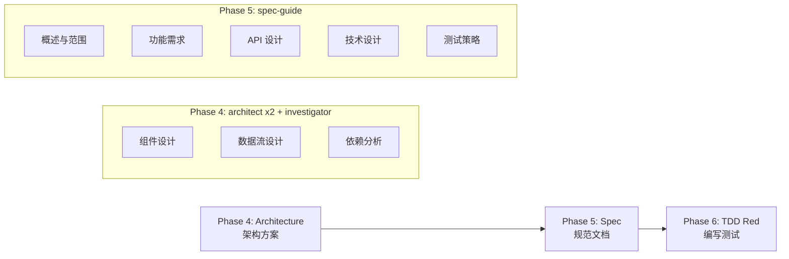
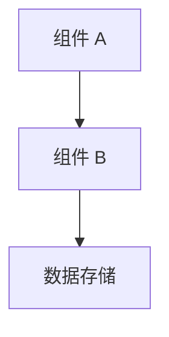
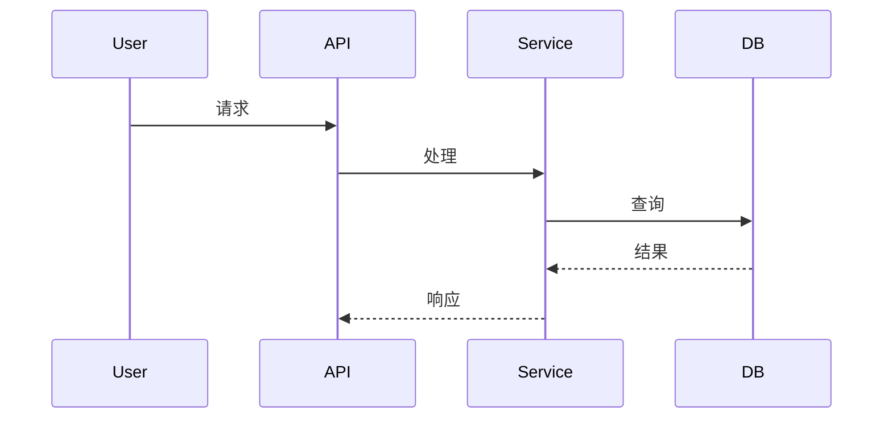

# SpecDD 规范

**SpecDD (Specification-Driven Development)** - 规范驱动开发

## 核心理念

> "对于复杂模块，先写规范文档，再写测试和实现。"

**SpecDD = Phase 4 (Architecture) + Phase 5 (Spec) → Phase 6 (TDD Red)**

---

## 何时使用 SpecDD

### 强制使用 (CODE_COMPLEX)

以下情况**必须**使用 SpecDD：

| 条件 | 说明 |
|:---|:---|
| **新功能** | 全新的功能模块 |
| **跨模块变更** | 涉及 3+ 个文件的修改 |
| **架构调整** | 影响系统架构的变更 |
| **API 设计** | 需要设计新的 API 接口 |
| **数据结构** | 需要设计新的数据模型 |

### 可选使用

| 条件 | 说明 |
|:---|:---|
| **复杂重构** | 需要规划重构步骤 |
| **性能优化** | 需要分析性能瓶颈 |
| **安全增强** | 需要设计安全方案 |

### 不使用

| 条件 | 说明 |
|:---|:---|
| **Bug 修复** | 直接 TDD |
| **小修改** | 单文件 < 50 行 |
| **配置调整** | 配置文件修改 |

---

## SpecDD 流程



---

## Phase 4: Architecture - 架构设计

### 目标

输出高层设计方案，为 Phase 5 的 Spec 文档提供基础。

### Agent

- `architect` x 2 (并行设计方案)
- `investigator` (依赖分析)

### 输出

**必须包含**：

| 项 | 说明 |
|:---|:---|
| **组件关系图** | Mermaid 或 ASCII 图 |
| **技术选型** | 技术栈和框架选择 |
| **目录结构** | 文件和目录组织 |
| **依赖关系** | 内部/外部依赖 |

### 输出位置

不输出文件，直接传递给 Phase 5。

---

## Phase 5: Spec - 规范文档

### 目标

基于 Phase 4 的架构方案，编写详细的技术规范文档。

### Agent

- `spec-guide` (Opus 4.5)

### 输出

**文件位置**: `.claude/specs/{feature-name}.md`

### Spec 文档结构

```markdown
# {功能名称} 规范文档

## 1. 概述

### 1.1 目标

清晰描述功能目标（1-2 句话）

### 1.2 范围

明确功能边界：
- 包含什么
- 不包含什么

### 1.3 非目标

明确不做什么（避免 scope creep）

## 2. 功能需求

### 2.1 用户故事

```
As a <角色>,
I want <功能>,
So that <价值>.
```

### 2.2 验收标准

**Given-When-Then 格式**：

```gherkin
Given [前置条件]
When [操作]
Then [预期结果]
```

### 2.3 边界条件

| 条件 | 预期行为 |
|:---|:---|
| 空值/null | 返回错误或默认值 |
| 空数组/字符串 | 返回空结果 |
| 最大值 | 截断或拒绝 |
| 并发冲突 | 错误或重试 |

## 3. API 设计

### 3.1 公开接口

```typescript
// 函数签名
function functionName(input: InputType): OutputType

// 请求/响应类型
interface InputType { ... }
interface OutputType { ... }
```

### 3.2 数据结构

```typescript
interface DataType {
  id: string;
  name: string;
  // ...
}
```

### 3.3 错误处理

| 错误码 | 场景 | 处理方式 |
|:---|:---|:---|
| `INVALID_INPUT` | 参数验证失败 | 返回 400 + 错误详情 |
| `NOT_FOUND` | 资源不存在 | 返回 404 |
| `CONFLICT` | 并发冲突 | 返回 409 + 重试信息 |

## 4. 技术设计

### 4.1 组件架构

基于 Phase 4 的架构方案：



### 4.2 数据流



### 4.3 依赖关系

| 依赖 | 类型 | 说明 |
|:---|:---:|:---|
| `database` | 内部 | 数据访问层 |
| `auth-service` | 外部 | 认证服务 |

## 5. 测试策略

### 5.1 单元测试覆盖

| 函数/方法 | 覆盖场景 |
|:---|:---|
| `createUser()` | 正常、参数校验、错误处理 |
| `validateEmail()` | 有效、无效、边界值 |

### 5.2 集成测试场景

```gherkin
Scenario: 用户注册成功
  Given 用户访问注册页面
  When 输入有效邮箱和密码
  Then 创建用户账户
  And 发送欢迎邮件
```

### 5.3 边界测试

- Null/Undefined
- 空数组/字符串
- 无效类型
- 边界值 (最大/最小)
- 特殊字符

## 6. 非功能需求

### 6.1 性能要求

| 指标 | 目标 |
|:---|:---:|
| 响应时间 | < 100ms (p95) |
| 吞吐量 | > 1000 req/s |
| 内存使用 | < 512 MB |

### 6.2 安全要求

- 输入验证和清理
- SQL 注入防护
- XSS 防护
- CSRF 令牌
- 认证和授权

### 6.3 可维护性

- 代码覆盖率 > 80%
- 关键路径有集成测试
- API 文档完整

---

## 质量检查清单

### Phase 4 Architecture

- [ ] 组件关系图清晰
- [ ] 技术选型合理
- [ ] 目录结构明确
- [ ] 依赖关系完整

### Phase 5 Spec

- [ ] 目标清晰明确
- [ ] 验收标准可测试
- [ ] API 设计完整（参数、返回值、错误）
- [ ] 数据结构定义清晰
- [ ] 测试策略全面（单元、集成、边界）
- [ ] 非功能需求已考虑

---

## 与 TDD 的关系

**SpecDD 是 TDD 的前置阶段**：

```
Phase 4 (Architecture) → Phase 5 (Spec) → Phase 6 (TDD Red)
    ↓                      ↓                   ↓
  高层设计              详细规范              编写测试
```

| Phase 5 输出 | Phase 6 对应 |
|:---|:---|
| 验收标准 | 测试用例 |
| API 设计 | 测试 mock |
| 边界条件 | 边缘测试 |
| 错误处理 | 异常测试 |

---

## 常见问题

### Q: Phase 4 和 Phase 5 的区别？

**Phase 4 (Architecture)**:
- 高层设计
- 组件关系
- 技术选型

**Phase 5 (Spec)**:
- 详细规范
- API 定义
- 测试策略

### Q: 何时跳过 SpecDD？

**CODE_SIMPLE** 和 **DOCUMENT** 工作流跳过 Phase 4 和 Phase 5。

### Q: Spec 文档要多详细？

**原则**：足够详细以便编写测试，但不包含实现细节。

**包含**：
- API 接口定义
- 数据结构
- 验收标准

**不包含**：
- 具体实现代码
- 变量命名
- 算法细节
