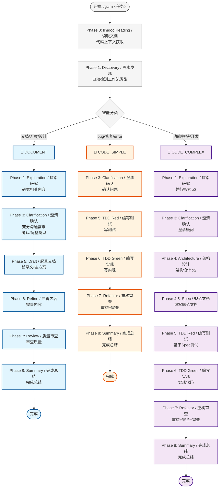
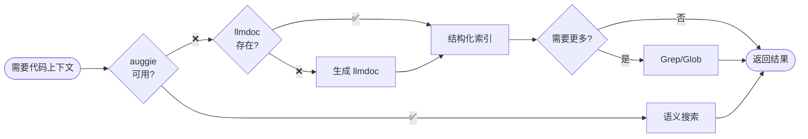

# gclm-flow 智能分流工作流 Skill

## 核心哲学

**SpecDD + TDD + Document-First + llmdoc 优先 + 分层回退 (auggie → llmdoc → Grep) + 多 Agent 并行 + 智能分流**

## 三种工作流类型

| 类型 | 检测关键词 | 适用场景 | 核心阶段 |
|:---|:---|:---|:---|
| 📝 **DOCUMENT** | 文档、方案、设计、需求、分析 | 文档编写、方案设计、架构设计 | Discovery → Exploration → Clarification → **Draft → Refine → Review** |
| 🔧 **CODE_SIMPLE** | bug、修复、error、fix | Bug修复、小修改、单文件变更 | Discovery → Clarification → TDD Red → TDD Green |
| 🚀 **CODE_COMPLEX** | 功能、模块、开发、重构 | 新功能、模块开发、跨文件变更 | **全流程** (含 SpecDD) |

## 循环初始化 (必需)

当通过 `/gclm <task>` 触发时，**首先**初始化循环状态：

```bash
"${SKILL_DIR}/../scripts/setup-gclm.sh" "<task description>"
```

这会创建 `.claude/gclm.{task_id}.local.md` 包含：
- `active: true`
- `current_phase: 0`
- `max_phases: 8`
- `completion_promise: "<promise>GCLM_WORKFLOW_COMPLETE</promise>"`

## 智能分流工作流

### 工作流程图 (Mermaid)



### 代码搜索分层回退



### 📝 DOCUMENT 工作流

**适用**: 文档编写、方案设计、架构设计、需求分析

| 阶段 | 名称 / Name | Agent | 说明 |
|:---|:---|:---|:---|
| 0 | llmdoc Reading / 读取文档 | 主 Agent | 读取项目文档 |
| 1 | Discovery / 需求发现 | `investigator` | 理解需求 |
| 2 | Exploration / 探索研究 | `investigator` x3 | 研究相关内容/示例 |
| 3 | Clarification / 澄清确认 | 主 Agent + AskUser | **充分沟通需求 + 确认/调整工作流类型** |
| 5 | Draft / 起草文档 | 主 Agent | **起草文档/方案** |
| 6 | Refine / 完善内容 | 主 Agent | **完善内容** |
| 7 | Review / 质量审查 | `code-reviewer` | 审查质量 |
| 8 | Summary / 完成总结 | `investigator` | 完成总结 |

**关键差异**:
- Phase 5: **起草**文档
- Phase 6: **完善**内容
- Phase 3 必须充分澄清需求后再动笔

**跳过的阶段**: Phase 4 (Architecture), Phase 4.5 (Spec)

### 🔧 CODE_SIMPLE 工作流

**适用**: Bug 修复、小修改、单文件变更

| 阶段 | 名称 / Name | Agent | 跳过 |
|:---|:---|:---|:---:|
| 0 | llmdoc Reading / 读取文档 | 主 Agent | - |
| 1 | Discovery / 需求发现 | `investigator` | - |
| 3 | Clarification / 澄清确认 | 主 Agent + AskUser | Phase 2, 4, 4.5 |
| 5 | TDD Red / 编写测试 | `tdd-guide` | - |
| 6 | TDD Green / 编写实现 | `worker` | - |
| 7 | Refactor+Review / 重构审查 | `code-simplifier` + `security-guidance` + `code-reviewer` | - |
| 8 | Summary / 完成总结 | `investigator` | - |

**跳过的阶段**: Phase 2 (Exploration), Phase 4 (Architecture), Phase 4.5 (Spec)

### 🚀 CODE_COMPLEX 工作流

**适用**: 新功能、模块开发、重构

| 阶段 | 名称 / Name | Agent | 并行 |
|:---|:---|:---|:---:|
| 0 | llmdoc Reading / 读取文档 | 主 Agent | - |
| 1 | Discovery / 需求发现 | `investigator` | - |
| 2 | Exploration / 探索研究 | `investigator` x3 | 是 |
| 3 | Clarification / 澄清确认 | 主 Agent + AskUser | - |
| 4 | Architecture / 架构设计 | `architect` x2 + `investigator` | 是 |
| **4.5** | **Spec / 规范文档** | `architect` + auggie/llmdoc | **-** |
| 5 | TDD Red / 编写测试 | `tdd-guide` | - |
| 6 | TDD Green / 编写实现 | `worker` | - |
| 7 | Refactor+Review / 重构审查 | `code-simplifier` + `security-guidance` + `code-reviewer` | 是 |
| 8 | Summary / 完成总结 | `investigator` | - |

## 硬约束

1. **Phase 0 强制**: 必须优先读取 llmdoc，不存在时自动生成
2. **代码搜索分层回退**: auggie (推荐) → llmdoc + Grep (备选)
3. **智能分流**: Phase 1 后自动判断任务类型（DOCUMENT / CODE_SIMPLE / CODE_COMPLEX）
4. **Phase 3 不可跳过**: 必须澄清所有疑问 + **确认/调整工作流类型**
5. **DOCUMENT 工作流**: Phase 5 起草，Phase 6 完善，**先充分沟通再动笔**
6. **CODE 工作流 Phase 5 TDD 强制**: 必须先写测试
7. **并行优先**: 能并行的任务必须并行执行
8. **状态持久化**: 每个阶段后自动更新状态文件（无需确认）
9. **选项式编程**: 使用 AskUserQuestion 展示选项
10. **文档更新询问**: Phase 7 必须询问

## 循环状态管理

**自动化**: 每个阶段后自动更新 `.claude/gclm.{task_id}.local.md` frontmatter，无需用户确认：

```yaml
current_phase: <下一阶段编号>
phase_name: "<下一阶段名称>"
```

**状态更新的自动化原因**:
- 状态文件是内部元数据，不是代码
- 更新是确定性的（阶段完成 → 状态更新）
- 不影响代码质量或安全性

**仍需授权的场景**:
- Phase 3: **工作流类型确认/调整**（自动检测可能有误）
- Phase 4 (CODE_COMPLEX): Architecture 设计方案审批
- Phase 7: 文档更新询问

当所有 8 阶段完成，输出完成信号：
```
<promise>GCLM_WORKFLOW_COMPLETE</promise>
```

提前退出：在状态文件中设置 `active: false`。

---

## Phase 0: llmdoc Reading + 代码搜索分层回退

### 自动化流程

1. **代码搜索分层回退**
   - 优先使用 auggie 进行语义搜索（推荐）
   - auggie 不可用时回退到 llmdoc + Grep

2. **检查 llmdoc/ 是否存在**
   - 存在 → 直接读取
   - 不存在 → **自动生成（不需要用户确认，直接执行）**

3. **自动生成 llmdoc（NON-NEGOTIABLE - 无需确认）**
   - 使用 `investigator` agent 扫描代码库
   - 生成 `llmdoc/index.md`
   - 生成 `llmdoc/overview/` 基础文档（project.md, tech-stack.md, structure.md）
   - **注意：这是初始化步骤，自动执行，不要询问用户**

4. **继续读取流程**
   - 读取 `llmdoc/index.md`
   - 读取 `llmdoc/overview/*.md` 全部
   - 根据任务读取 `llmdoc/architecture/*.md`

### 代码搜索方法

| 方法 | 优势 | 劣势 | 状态 |
|:---|:---|:---|:---:|
| **auggie** | 语义搜索、自然语言查询 | 需要外部服务 | 推荐 |
| **llmdoc + Grep** | 本地、无需外部依赖 | 功能较弱约 20-30% | 备选 |

**安装 auggie（可选但推荐）**:
```bash
npm install -g @augmentcode/auggie@prerelease
```

### 生成约束

- **最小化生成**: 只生成基础文档
- **增量完善**: 后续可在 Phase 7 补充
- **保持简洁**: 避免过度生成
- **直接执行**: llmdoc 不存在时自动生成，**不询问用户**

## 并行执行示例

### Phase 2: Exploration (3 个并行任务)
```bash
codeagent-wrapper --parallel <<'EOF'
---TASK---
id: p2_similar_features
agent: gclm-investigator
workdir: .
---CONTENT---
Find similar features, trace end-to-end.

---TASK---
id: p2_architecture
agent: gclm-investigator
workdir: .
---CONTENT---
Map architecture for relevant subsystem.

---TASK---
id: p2_conventions
agent: gclm-investigator
workdir: .
---CONTENT---
Identify testing patterns and conventions.
EOF
```

### Phase 4: Architecture (2 个并行方案 + 1 个测试策略)

**重要**: 必须等待 agents 完成并展示方案后，再询问用户选择

```bash
# 步骤 1: 并行启动 3 个 agents
codeagent-wrapper --parallel <<'EOF'
---TASK---
id: p4_minimal
agent: gclm-architect
workdir: .
---CONTENT---
Propose minimal-change architecture.

---TASK---
id: p4_pragmatic
agent: gclm-architect
workdir: .
---CONTENT---
Propose pragmatic-clean architecture.

---TASK---
id: p4_test_strategy
agent: gclm-investigator
workdir: .
---CONTENT---
Analyze testing strategy for this change.
EOF

# 步骤 2: 等待完成后，使用 TaskOutput 获取每个 agent 的输出
TaskOutput("p4_minimal", block=true)
TaskOutput("p4_pragmatic", block=true)
TaskOutput("p4_test_strategy", block=true)

# 步骤 3: 格式化展示方案给用户
# (将 3 个方案以清晰的格式展示)

# 步骤 4: 等待用户阅读后，使用 AskUserQuestion 询问选择
```

**关于 llmdoc**: Phase 4 不会自动生成/更新 llmdoc，文档更新在 Phase 7 询问用户后进行

## Agent 体系

| Agent | 职责 | 模型 |
|:---|:---|:---|
| `investigator` | 探索、分析、总结 | Haiku 4.5 |
| `architect` | 架构设计、方案权衡 | Opus 4.5 |
| `worker` | 执行明确定义的任务 | Sonnet 4.5 |
| `tdd-guide` | TDD 流程指导 | Sonnet 4.5 |
| `code-simplifier` | 代码简化重构 | Sonnet 4.5 |
| `security-guidance` | 安全审查 | Sonnet 4.5 |
| `code-reviewer` | 代码审查 | Sonnet 4.5 |

## 上下文包模板

```text
## Original User Request
<verbatim request>

## Context Pack
- Phase: <0-8 name>
- Decisions: <requirements/constraints/choices>
- Investigator output: <paste or "None">
- Architect output: <paste or "None">
- Worker output: <paste or "None">
- Tdd-guide output: <paste or "None">
- Code-simplifier output: <paste or "None">
- Security-guidance output: <paste or "None">
- Code-reviewer output: <paste or "None">
- Open questions: <list or "None">

## Current Task
<specific task>

## Acceptance Criteria
<checkable outputs>
```

## Stop Hook

注册 Stop Hook 后：
1. 创建 `.claude/gclm.{task_id}.local.md` 状态文件
2. 每个阶段后更新 `current_phase`
3. Stop hook 检查状态，未完成时阻止退出
4. 完成时输出 `<promise>GCLM_WORKFLOW_COMPLETE</promise>`

手动退出：在状态文件中设置 `active` 为 `false`。

---

## auggie 快速参考

### 安装
```bash
# 全局安装 auggie
npm install -g @augmentcode/auggie@prerelease
```

### MCP 工具
Claude Code 可直接调用 auggie 提供的 MCP 工具进行：
- 自然语言代码搜索
- 代码上下文增强
- 语义代码理解

### 使用示例
```javascript
// Claude Code 自动调用，无需手动命令
// 搜索 "用户认证相关的代码"
// auggie 会自动理解意图并返回相关代码片段和上下文
```

### 配置
```bash
# 环境变量（可选）
export AUGMENT_API_TOKEN="your-token"
export AUGMENT_API_URL="https://acemcp.heroman.wtf/relay/"
```

### 项目支持
auggie 支持多种编程语言和文件类型，提供智能代码搜索和上下文理解。
