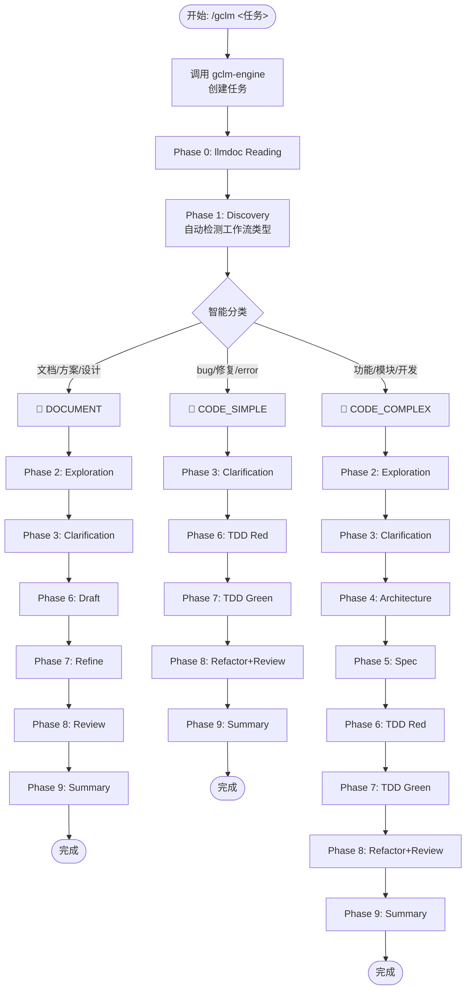

## 核心哲学

**SpecDD + TDD + Document-First + llmdoc 优先 + 分层回退 (auggie → llmdoc → Grep) + 多 Agent 并行 + 智能分流**

## 重要: 文件操作指导

### 读取和搜索 - shell 工具更快

```bash
# 读取（推荐 shell）
cat file.txt
head -20 file.txt
tail -50 file.txt

# 搜索（推荐 shell）
find . -name "*.ts"
grep "pattern" file.txt
```

### 创建和编辑 - 避免使用 shell

**创建文件**: 使用 `Write` 工具，禁止 touch/echo/cat >

**编辑文件**:
1. **复杂编辑**: Read → 分析 → Write（推荐）
2. **简单替换**: Edit 工具（谨慎，确保上下文唯一）
3. **禁止**: sed/awk/perl/vim 等 shell 编辑工具

## 三种工作流类型

| 类型 | 检测关键词 | 适用场景 | 核心阶段 |
|:---|:---|:---|:---|
| 📝 **DOCUMENT** | 文档、方案、设计、需求、分析 | 文档编写、方案设计、架构设计 | Discovery → Exploration → Clarification → **Draft → Refine → Review** |
| 🔧 **CODE_SIMPLE** | bug、修复、error、fix | Bug修复、小修改、单文件变更 | Discovery → Clarification → TDD Red → TDD Green |
| 🚀 **CODE_COMPLEX** | 功能、模块、开发、重构 | 新功能、模块开发、跨文件变更 | **全流程** (含 SpecDD) |

## 循环初始化 (必需)

当通过 `/gclm <task>` 触发时，**首先**初始化循环状态：

### 步骤 1: 调用 Go 引擎创建任务

```bash
# gclm-engine 安装在 ~/.gclm-flow/，workflows 也在同一目录
~/.gclm-flow/gclm-engine workflow start "<task description>" --json
```

**返回示例**:
```json
{
  "task_id": "task-xxx",
  "workflow_type": "CODE_SIMPLE",
  "total_phases": 8,
  "current_phase": {
    "phase_id": "phase-xxx",
    "phase_name": "discovery",
    "display_name": "Discovery / 需求发现",
    "agent": "investigator",
    "model": "haiku",
    "sequence": 0,
    "required": true,
    "timeout": 60
  },
  "message": "Workflow started successfully"
}
```

### 步骤 2: 保存 task_id 到本地状态文件

创建 `.claude/gclm-engine.local.md` 用于持久化当前任务 ID：

```markdown
---
active: true
task_id: task-xxx
workflow_type: CODE_SIMPLE
current_phase: 0
total_phases: 8
completion_promise: "<promise>GCLM_WORKFLOW_COMPLETE"
---

# gclm-engine 任务状态

**Task ID**: task-xxx
**Workflow**: CODE_SIMPLE
**当前阶段**: 0 - Discovery / 需求发现
```

## 智能分流工作流

### 工作流程图 (Mermaid)



### 📝 DOCUMENT 工作流

**适用**: 文档编写、方案设计、架构设计、需求分析

| 阶段 | 名称 / Name | Agent | 调用方式 | 说明 |
|:---|:---|:---|:---|:---|
| 0 | llmdoc Reading / 读取文档 | 主 Agent | - | 读取项目文档 |
| 1 | Discovery / 需求发现 | 自然语言: investigator | - | 理解需求 |
| 2 | Exploration / 探索研究 | `Explore` x3 | Task 并行 | 研究相关内容 |
| 3 | Clarification / 澄清确认 | 主 Agent + AskUser | - | **确认/调整工作流类型** |
| 6 | Draft / 起草文档 | 主 Agent | - | **起草文档/方案** |
| 7 | Refine / 完善内容 | 主 Agent | - | **完善内容** |
| 8 | Review / 质量审查 | `general-purpose` | Task | 审查质量 |
| 9 | Summary / 完成总结 | 自然语言: investigator | - | 完成总结 |

### 🔧 CODE_SIMPLE 工作流

**适用**: Bug 修复、小修改、单文件变更

| 阶段 | 名称 / Name | Agent | 调用方式 |
|:---|:---|:---|:---|
| 0 | llmdoc Reading / 读取文档 | 主 Agent | - |
| 1 | Discovery / 需求发现 | 自然语言: investigator | - |
| 3 | Clarification / 澄清确认 | 主 Agent + AskUser | - |
| 6 | TDD Red / 编写测试 | 自然语言: tdd-guide | - |
| 7 | TDD Green / 编写实现 | 自然语言: worker | - |
| 8 | Refactor+Review / 重构审查 | `code-simplifier` + `security-guidance` | Task 并行 |
| 9 | Summary / 完成总结 | 自然语言: investigator | - |

### 🚀 CODE_COMPLEX 工作流

**适用**: 新功能、模块开发、重构

| 阶段 | 名称 / Name | Agent | 调用方式 | 并行 |
|:---|:---|:---|:---|:---:|
| 0 | llmdoc Reading / 读取文档 | 主 Agent | - | - |
| 1 | Discovery / 需求发现 | 自然语言: investigator | - | - |
| 2 | Exploration / 探索研究 | `Explore` x3 | Task | 是 |
| 3 | Clarification / 澄清确认 | 主 Agent + AskUser | - | - |
| 4 | Architecture / 架构设计 | 自然语言: architect x2 | 串行 | - |
| **5** | **Spec / 规范文档** | 自然语言: spec-guide | - | **-** |
| 6 | TDD Red / 编写测试 | 自然语言: tdd-guide | - | - |
| 7 | TDD Green / 编写实现 | 自然语言: worker | - | - |
| 8 | Refactor+Review / 重构审查 | `code-simplifier` + `security-guidance` | Task | 是 |
| 9 | Summary / 完成总结 | 自然语言: investigator | - | - |

## 硬约束

1. **Phase 0 强制**: 必须优先读取 llmdoc，不存在时自动生成
2. **代码搜索分层回退**: auggie (推荐) → llmdoc + Grep (备选)
3. **智能分流**: Phase 1 后自动判断任务类型
4. **Phase 3 不可跳过**: 必须澄清所有疑问 + **确认/调整工作流类型**
5. **DOCUMENT 工作流**: Phase 6 起草，Phase 7 完善，**先充分沟通再动笔**
6. **CODE 工作流 Phase 6 TDD 强制**: 必须先写测试
7. **并行优先**: 能并行的任务必须并行执行
8. **状态持久化**: 每个阶段后使用 Go 引擎更新状态

## Go 引擎命令

### 工作流管理

```bash
# 一键开始工作流（创建任务 + 获取第一阶段）
~/.gclm-flow/gclm-engine workflow start "<prompt>" --json

# 获取当前应该执行的阶段
~/.gclm-flow/gclm-engine task current <task-id> --json

# 获取完整执行计划
~/.gclm-flow/gclm-engine task plan <task-id> --json

# 完成阶段
~/.gclm-flow/gclm-engine task complete <task-id> <phase-id> --output "<output>" --json

# 标记阶段失败
~/.gclm-flow/gclm-engine task fail <task-id> <phase-id> --error "<error>" --json

# 列出任务阶段
~/.gclm-flow/gclm-engine task phases <task-id>

# 列出所有任务
~/.gclm-flow/gclm-engine task list
```

### 阶段执行流程

每个阶段执行时：

1. **开始阶段**:
   ```bash
   ~/.gclm-flow/gclm-engine task current <task-id> --json
   ```
   获取当前阶段信息（agent, model, 等）

2. **执行阶段**: 调用相应的 Agent 或 Task

3. **完成阶段**:
   ```bash
   ~/.gclm-flow/gclm-engine task complete <task-id> <phase-id> --output "<阶段输出>" --json
   ```

4. **进入下一阶段**: 重复步骤 1

## Agent 体系

| Agent | 职责 | 模型 | 阶段 |
|:---|:---|:---|:---|
| `investigator` | 探索、分析、总结 | Haiku 4.5 | 1, 2, 9 |
| `architect` | 架构设计、方案权衡 | Opus 4.5 | 4 |
| `spec-guide` | SpecDD 规范文档编写 | Opus 4.5 | 5 |
| `tdd-guide` | TDD 流程指导 | Sonnet 4.5 | 6 |
| `worker` | 执行明确定义的任务 | Sonnet 4.5 | 7 |
| `code-simplifier` | 代码简化重构 | Sonnet 4.5 | 8 |
| `security-guidance` | 安全审查 | Sonnet 4.5 | 8 |
| `code-reviewer` | 代码审查 | Sonnet 4.5 | 8 |

## 并行执行示例

### Phase 2: Exploration (3 个并行任务)

```
并行启动 3 个 Task:
- Task 1: investigator - 相似功能搜索
- Task 2: investigator - 架构映射
- Task 3: investigator - 代码规范识别
```

### Phase 4: Architecture (2 个方案设计)

```
串行执行（保持自定义规则）:
1. architect 方案 A
2. architect 方案 B
3. 展示方案 + AskUserQuestion
```

### Phase 8: Refactor+Review (3 个并行)

```
并行启动:
- Task 1: code-simplifier - 代码简化
- Task 2: security-guidance - 安全审查
- Task 3: code-reviewer - 代码审查
```

## Phase 0: llmdoc Reading + 代码搜索分层回退

### 自动化流程

1. **代码搜索分层回退**
   - 优先使用 auggie 进行语义搜索（推荐）
   - auggie 不可用时回退到 llmdoc + Grep

2. **检查 llmdoc/ 是否存在**
   - 存在 → 直接读取
   - 不存在 → **自动生成（不需要用户确认，直接执行）**

3. **自动生成 llmdoc**
   - 使用 `investigator` agent 扫描代码库
   - 生成 `llmdoc/index.md`
   - 生成 `llmdoc/overview/` 基础文档

### 代码搜索方法

| 方法 | 优势 | 劣势 | 状态 |
|:---|:---|:---|:---:|
| **auggie** | 语义搜索、自然语言查询 | 需要外部服务 | 推荐 |
| **llmdoc + Grep** | 本地、无需外部依赖 | 功能较弱约 20-30% | 备选 |

**安装 auggie（可选但推荐）**:
```bash
npm install -g @augmentcode/auggie@prerelease
```

## 循环状态管理

### 状态文件

创建 `.claude/gclm-engine.local.md`:

```markdown
---
active: true
task_id: task-xxx
workflow_type: CODE_SIMPLE
current_phase: 0
total_phases: 8
phase_name: "discovery"
completion_promise: "<promise>GCLM_WORKFLOW_COMPLETE"
---

# gclm-engine 任务状态

**Task ID**: task-xxx
**Workflow**: CODE_SIMPLE
**当前阶段**: 0 - Discovery / 需求发现
**总阶段数**: 8
```

### 状态更新

每个阶段完成后：
1. 调用 `~/.gclm-flow/gclm-engine task complete` 更新数据库
2. 更新本地状态文件的 `current_phase`
3. 调用 `~/.gclm-flow/gclm-engine task current` 获取下一阶段

### 完成信号

当所有阶段完成，输出：
```
<promise>GCLM_WORKFLOW_COMPLETE</promise>
```

## Stop Hook

注册 Stop Hook 后：
1. Go 引擎维护任务状态（SQLite）
2. 每个阶段后调用 Go 引擎更新状态
3. 本地状态文件记录当前任务 ID
4. 完成时输出完成信号

---

## auggie 快速参考

### 安装
```bash
npm install -g @augmentcode/auggie@prerelease
```

### 使用
Claude Code 可直接调用 auggie MCP 工具进行：
- 自然语言代码搜索
- 代码上下文增强
- 语义代码理解
